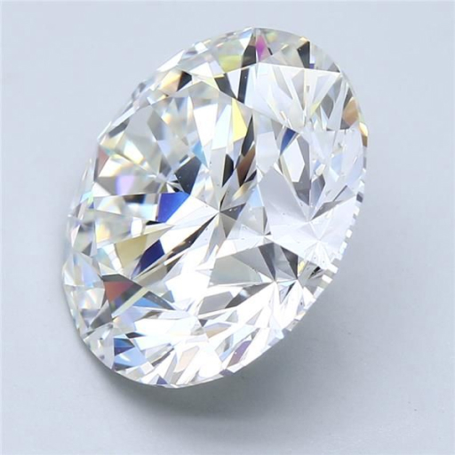
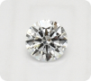
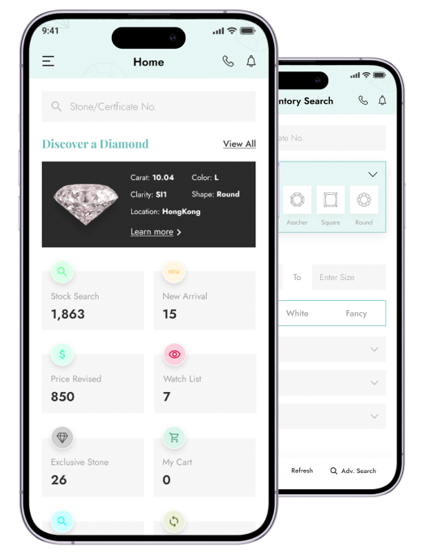

# Excellent Web - Jewelry E-commerce Platform

A modern, feature-rich React-based e-commerce platform for jewelry and diamond sales, built with cutting-edge web technologies and best practices.

## 🚀 Features

- **Diamond & Jewelry Catalog**: Comprehensive product browsing with advanced filtering
- **Custom Ring Builder**: Interactive tool for designing custom engagement rings
- **User Authentication**: Secure login/signup with session management
- **Shopping Cart**: Full-featured cart with wishlist functionality
- **Order Management**: Complete order tracking and purchase history
- **Educational Content**: Diamond education and jewelry guides
- **Responsive Design**: Mobile-first approach with modern UI/UX
- **International Support**: Multi-language and phone number support

## 📸 Screenshots

### Homepage


_Main landing page showcasing featured jewelry and diamonds_

### Diamond Catalog


_Comprehensive diamond browsing with advanced filters_

### Custom Ring Builder


_Interactive tool for designing custom engagement rings_

### User Dashboard


_Personalized user account management_

### Shopping Cart


_Full-featured shopping cart with product management_

### Mobile Responsive


_Mobile-optimized interface for on-the-go shopping_

## 🛠️ Tech Stack

### Frontend

- **React 18** - Modern React with hooks and functional components
- **React Router 6** - Client-side routing
- **Redux Toolkit** - State management
- **Material-UI (MUI)** - Component library
- **PrimeReact** - Advanced UI components
- **Bootstrap 5** - CSS framework
- **Sass/SCSS** - CSS preprocessing

### Development Tools

- **ESLint** - Code linting
- **Prettier** - Code formatting
- **React Scripts** - Build and development tools

### Additional Libraries

- **Axios** - HTTP client
- **Formik + Yup** - Form handling and validation
- **React Toastify** - Notifications
- **Swiper** - Touch slider
- **React Table** - Data tables

## 📁 Project Structure

```
src/
├── app/                 # Main application entry point
├── Assets/             # Static assets (CSS, fonts, images)
│   ├── css/           # Global and component styles
│   ├── Fonts/         # Custom fonts
│   └── Images/        # Image assets
├── Components/         # React components
│   ├── About/         # About page components
│   ├── Account/       # User account management
│   ├── CustomizeRing/ # Ring customization tools
│   ├── Diamond/       # Diamond-related components
│   ├── Education/     # Educational content
│   ├── Global/        # Shared components (Header, Footer)
│   ├── Jewellery/     # Jewelry components
│   └── Redux/         # State management
├── Helper/            # Utility functions
└── routes/            # Routing configuration
```

## 🚀 Getting Started

### Prerequisites

- Node.js >= 14.x
- npm or yarn package manager

### Installation

1. **Clone the repository**

   ```bash
   git clone <repository-url>
   cd Excellent-Web
   ```

2. **Install dependencies**

   ```bash
   npm install
   # or
   yarn install
   ```

3. **Environment Setup**
   Create a `.env` file in the root directory:

   ```env
   REACT_APP_API_URL=your_api_url_here
   ```

4. **Start Development Server**

   ```bash
   npm start
   # or
   yarn start
   ```

5. **Build for Production**
   ```bash
   npm run build
   # or
   yarn build
   ```

## 📱 Available Scripts

- `npm start` - Start development server
- `npm run build` - Build for production
- `npm test` - Run tests
- `npm run lint` - Run ESLint
- `npm run lint:fix` - Fix ESLint issues
- `npm run prettify` - Format code with Prettier

## 🌟 Key Components

### Custom Ring Builder

- **ChooseDiamond**: Diamond selection interface
- **ChooseYourSetting**: Ring setting customization
- **CustomizeRingSteps**: Step-by-step ring building process

### Diamond Management

- Advanced filtering and search
- Detailed diamond specifications
- Comparison tools
- Certification information

### User Experience

- Responsive navigation
- Interactive product galleries
- Advanced search and filtering
- Wishlist and favorites

## 🎨 Styling

The project uses a combination of:

- **SCSS/Sass** for custom styling
- **Material-UI** for consistent component design
- **Bootstrap** for responsive grid and utilities
- **Custom CSS** for specialized components

## 🔧 Configuration

### ESLint

- Extends `react-app` configuration
- Includes Prettier integration
- Automatic fixing available

### Browserslist

- Production: Modern browsers with >0.2% market share
- Development: Latest Chrome, Firefox, and Safari versions

## 📦 Dependencies

### Core Dependencies

- React ecosystem (React, React-DOM, React-Router)
- State management (Redux Toolkit, React-Redux)
- UI libraries (Material-UI, PrimeReact, Bootstrap)
- Form handling (Formik, Yup)
- HTTP client (Axios)

### Development Dependencies

- ESLint configuration
- Prettier formatting
- Build tools

## 🚀 Deployment

The project includes Vercel configuration for easy deployment:

```bash
# Deploy to Vercel
vercel --prod

# Or use the included vercel.json configuration
```

## 🤝 Contributing

1. Fork the repository
2. Create a feature branch (`git checkout -b feature/amazing-feature`)
3. Commit your changes (`git commit -m 'Add amazing feature'`)
4. Push to the branch (`git push origin feature/amazing-feature`)
5. Open a Pull Request

## 📄 License

This project is private and proprietary.

## 📞 Support

For support and questions, please contact the development team.

---

**Built with ❤️ using React and modern web technologies**
